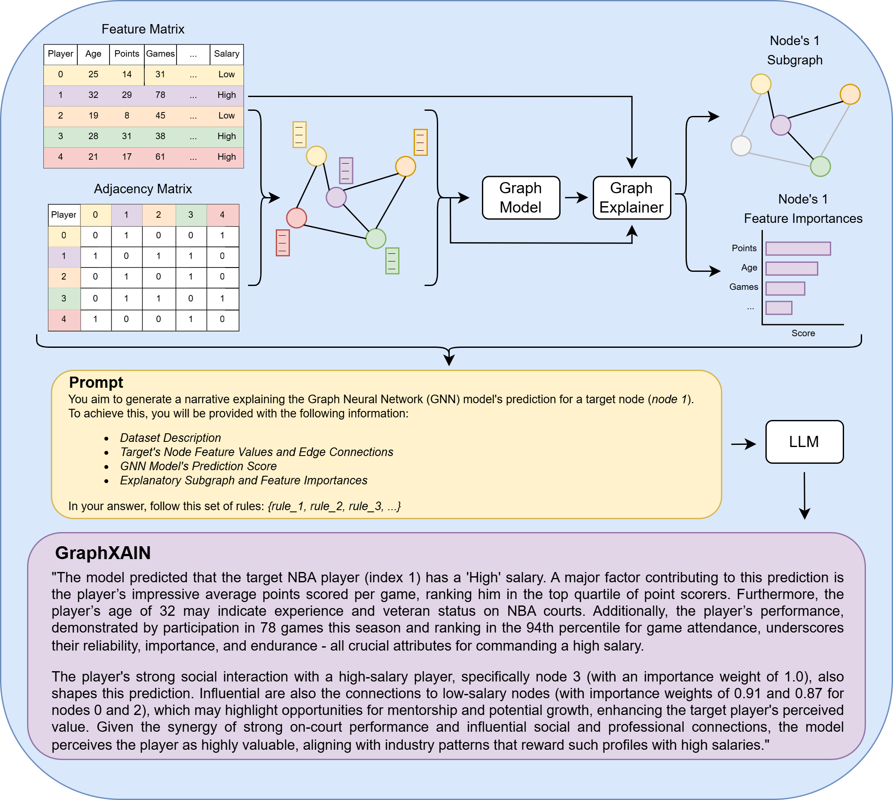
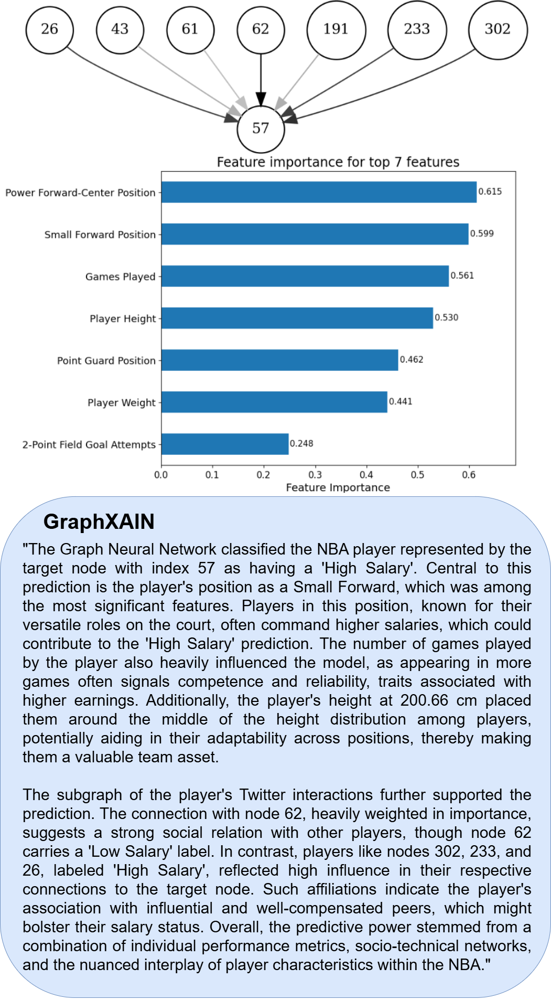

# GraphXAIN: Narratives to Explain Graph Neural Networks

This repository contains the official implementation for the article **GraphXAIN: Narratives to Explain Graph Neural Networks** (Cedro & Martens, 2024). Our method integrates Graph Neural Networks (GNNs), graph explainers, and Large Language Models (LLMs) to generate GraphXAINs, explainable AI (XAI) narratives that enhance the interpretability of GNN predictions.

# Workflow





## Abstract

Graph Neural Networks (GNNs) are a powerful technique for machine learning on graph-structured data, yet they pose challenges in interpretability. Existing GNN explanation methods usually yield technical outputs, such as subgraphs and feature importance scores, that are difficult for non-data scientists to understand and thereby violate the purpose of explanations. Motivated by recent Explainable AI (XAI) research, we propose *GraphXAIN*, a method that generates natural language narratives explaining GNN predictions. GraphXAIN is a model- and explainer-agnostic method that uses Large Language Models (LLMs) to translate explanatory subgraphs and feature importance scores into coherent, story-like explanations of GNN decision-making processes. Evaluations on real-world datasets demonstrate GraphXAIN's ability to improve graph explanations. A survey of machine learning researchers and practitioners reveals that GraphXAIN enhances four explainability dimensions: understandability, satisfaction, convincingness, and suitability for communicating model predictions. When combined with another graph explainer method, GraphXAIN further improves trustworthiness, insightfulness, confidence, and usability. Notably, 95% of participants found GraphXAIN to be a valuable addition to the GNN explanation method. By incorporating natural language narratives, our approach serves both graph practitioners and non-expert users by providing clearer and more effective explanations.

## Usage

To generate GraphXAINs for a given GNN model:

1. **Prepare Data**: Ensure you have ready-to-use graph data or adjacency matrix with features matrix ready for the input graph.
2. **Train GNN Model**: Train your GNN model.
3. **Run the Graph Explainer**: Follow the ```notebooks/GraphXAIN_tutorial.ipynb``` notebook to extract subgraphs and feature importance values.
4. **Generate GraphXAINs**:  Follow the ```notebooks/GraphXAIN_tutorial.ipynb``` notebook to generate GraphXAINs based on the extracted data.

## Required Changes in PyTorch Geometric

To successfully run the code in this repository, **you must modify** certain functions in PyTorch Geometric. We have provided a file, `pyg_modifications.py`, which contains **all** the updated functions needed.

1. **Open our `pyg_modifications.py`**  
   - This file is in the root of this repo (or wherever you placed it).
   - Inside, you’ll find code blocks for each function that needs patching:
     - `Explanation.visualize_graph`
     - `HeteroExplanation.visualize_feature_importance`
     - `_visualize_score`
     - `_visualize_graph_via_graphviz`

2. **Copy each code block** into PyTorch Geometric  
   - For example, copy the `visualize_graph` block into:
     ```
     torch_geometric/explain/explanation.py
     ```
     within the `Explanation` class.
   - Similarly, copy the `visualize_feature_importance` block into the `HeteroExplanation` class in the same file.
   - Copy the `_visualize_score` function wherever it is declared in that file (either replacing the existing one or adding it if missing).
   - Lastly, copy the `_visualize_graph_via_graphviz` block into:
     ```
     torch_geometric/visualization/graph.py
     ```
     replacing the existing function if present.

**Note:** Please ensure you run notebooks from the **root directory** of this repository. This guarantees that the file paths and environment references will resolve correctly.


## Repository Structure

- `datasets/`: Contains sample datasets used in the paper.
- `notebooks/`: Jupyter notebooks to generate GraphXAINs.
- `explanations/`: Contains outputs from graph explainer.
- `utils/`: Contains ```model.py``` with GNN model and ```utils.py``` with utility functions.
- `images/`: Contains images used in publication.
- `survey/`: Contains survey results conducted to do human evaluation of GraphXAINs.


## Citation

If you find this work useful, please cite our paper:

```bibtex
@article{cedro2024graphxain,
  title={GraphXAIN: Narratives to Explain Graph Neural Networks},
  author={Cedro, Mateusz and Martens, David},
  journal={arXiv preprint arXiv:2411.02540},
  year={2024}
}
```

## License

This project is licensed under the MIT License.

## Contact

For questions or collaborations, feel free to contact:
- **Mateusz Cedro**: [mateusz.cedro@uantwerpen.be]
- **Affiliation**: University of Antwerp, Belgium

We appreciate any feedback or contributions to the project!
